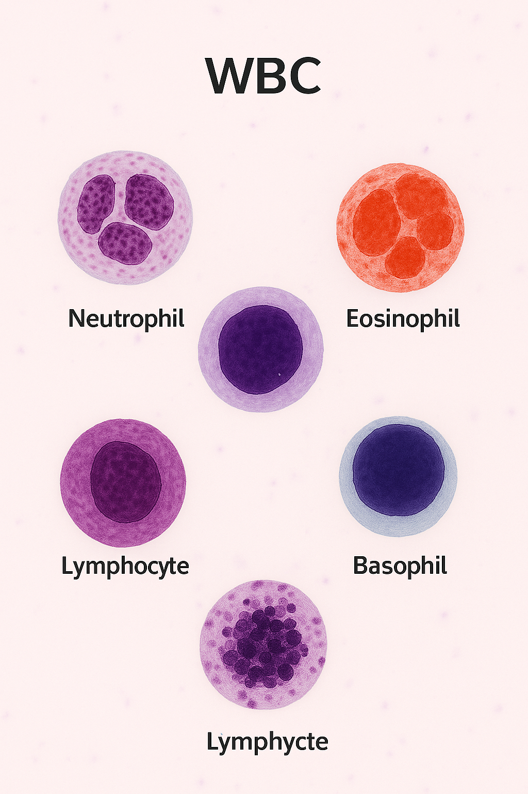

# 🧬 WBC Classification Using CNN vs MobileNetV2

## 📌 Project Overview

This project aims to classify human white blood cell (WBC) types using two different deep learning approaches:
- A custom **Convolutional Neural Network (CNN)** model
- A **Transfer Learning** model using **MobileNetV2**

Our goal was to compare the performance, generalization ability, and efficiency of both approaches on a real-world microscopic blood smear image dataset.

---

## 🩸 What Are White Blood Cells?

White blood cells (WBCs) are essential components of the human immune system. There are 5 primary types:
- **Neutrophil** 🟠
- **Eosinophil** 🟠
- **Basophil** 🔵
- **Monocyte** 🟤
- **Lymphocyte** 🟣

Accurate classification helps pathologists detect infections, allergies, leukemia, and other disorders.

---


---

## 🗂️ Dataset Structure

The dataset contains labeled microscopic images of white blood cells, organized like this:

```plaintext
Dataset/
├── Train/
│   ├── Neutrophil/
│   ├── Eosinophil/
│   ├── Basophil/
│   ├── Monocyte/
│   └── Lymphocyte/
├── Test/
│   └── ...
├── Balanced_Train/   # ✅ Automatically generated (see below)

⚠️ Balanced_Train is excluded from this repo due to size.
You can generate it using the code or request download access.
```
---

## Preprocessing & Balancing Strategy
The original training data in Dataset/Train/ was imbalanced, with some WBC types like Basophils having very few images compared to Neutrophils.
To solve this, we created a new folder Balanced_Train/ by:

1. Copying original images of each class
2. Augmenting underrepresented classes using:
3. Rotation (±15°)
4. Zoom (±10%)
5. Horizontal flip
6. Nearest-pixel filling

All classes were augmented up to the size of the majority class (Neutrophil: 6231 images).
``` The Balanced_Train/ folder is ignored from GitHub, but you can regenerate it using the notebook with just one click.```

```python
from tensorflow.keras.preprocessing.image import ImageDataGenerator, load_img, img_to_array, array_to_img
import os, shutil

source_dir = "../Dataset/Train"
balanced_dir = "../Dataset/Balanced_Train"

# Create balanced dir
os.makedirs(balanced_dir, exist_ok=True)

# Augmentation settings
datagen = ImageDataGenerator(
    rotation_range=15,
    zoom_range=0.1,
    horizontal_flip=True,
    fill_mode='nearest'
)

# Count class images
class_counts = {}
for class_name in os.listdir(source_dir):
    path = os.path.join(source_dir, class_name)
    class_counts[class_name] = len(os.listdir(path))

target_count = max(class_counts.values())

# Balance classes
for class_name, count in class_counts.items():
    src = os.path.join(source_dir, class_name)
    dst = os.path.join(balanced_dir, class_name)
    os.makedirs(dst, exist_ok=True)

    # Copy originals
    for fname in os.listdir(src):
        shutil.copy(os.path.join(src, fname), os.path.join(dst, fname))

    # Generate augmented images
    if count < target_count:
        needed = target_count - count
        generated = 0
        image_files = os.listdir(src)

        while generated < needed:
            for fname in image_files:
                if generated >= needed:
                    break

                img = load_img(os.path.join(src, fname))
                x = img_to_array(img).reshape((1,) + img.size + (3,))

                for batch in datagen.flow(x, batch_size=1):
                    array_to_img(batch[0]).save(os.path.join(dst, f"aug_{generated}_{fname}"))
                    generated += 1
                    break
```
Project Structure:
```plaintext
.
├── Dataset/          # WBC image folders (Train, Test, Balanced_Train)
├── Model/            # Trained Keras models (.h5 files)
├── Notebook/
│   └── code.ipynb    # Main training & evaluation code
├── Image/
│   └── main.png     
└── README.md         
```
---
## 🧠 Model Approaches

To classify white blood cell (WBC) types, we explored **two deep learning strategies**:

1. **Custom CNN** – A convolutional neural network built from scratch, optimized for the structure of our dataset.
2. **Transfer Learning with MobileNetV2** – A lightweight, pre-trained architecture used as a feature extractor to leverage learned representations from ImageNet.

Both models were trained and evaluated on a **balanced dataset** and compared based on accuracy and generalization performance.

---

### ✅ 1. Custom CNN Architecture

The custom CNN was designed specifically for image-based classification of white blood cells with the following key components:

- **Input Rescaling**: Pixel values normalized using `Rescaling(1./255)`
- **5 Convolutional Layers** with:
  - Increasing filter sizes: `4 → 8 → 16 → 32 → 64`
  - Stride of `2` for downsampling
  - `ReLU` activation
  - `padding='same'` to preserve feature map size
- **Batch Normalization** after each convolutional and dense layer for faster convergence
- **Flatten layer** before classification head
- **Dense Layers**:
  - One hidden dense layer with 8 units (`ReLU`)
  - Final output layer with 5 units (`softmax`) for classifying:  
    **Neutrophil, Eosinophil, Basophil, Monocyte, Lymphocyte**

> ✅ Achieved **93% test accuracy** after training on the balanced dataset


### 🤖 2. MobileNetV2 (Transfer Learning)

We implemented a transfer learning approach using **MobileNetV2** as a feature extractor. The key components of the architecture include:

- **Base Model**:  
  - `MobileNetV2` (pre-trained on ImageNet)  
  - `include_top=False` to remove the default classification layer  
  - Input shape: `(224, 224, 3)`  
  - Frozen weights to retain pretrained features

- **Custom Classification Head**:
  - `GlobalAveragePooling2D` to reduce spatial dimensions
  - `Dense` layer with 16 units (`ReLU`)  
  - `BatchNormalization` for stability
  - Final `Dense` layer with 5 units (`softmax`) for 5 WBC classes

- **Callbacks Used**:
  - `EarlyStopping`: Stop training when validation performance stops improving  
  - `ReduceLROnPlateau`: Lower learning rate on plateaus  
  - `ModelCheckpoint`: Save only the best-performing model (`mobile_model_1.h5`)

📉 Optimized using `AdamW` optimizer with `categorical_crossentropy` loss  
✅ This model achieved **89% test accuracy** on unseen WBC images

### ⚠️ Transfer Learning: Not Always Superior

While transfer learning with pretrained models like MobileNetV2 can be powerful, it's important to note:

- These models are originally trained on **ImageNet**, which contains **general object categories**, not specialized domains like **white blood cells**.
- If your dataset contains **very different features** compared to ImageNet classes, the **pretrained features may not generalize well**.

> ❗ In our case, despite using a sophisticated pretrained MobileNetV2 architecture, the **custom CNN outperformed it** with higher test accuracy (93% vs 89%).

This highlights the importance of **experimenting with both custom and transfer learning models**, especially when working in specialized domains like **medical imaging**.

| Model       | Test Accuracy | Generalization | Training Time |
| ----------- | ------------- | -------------- | ------------- |
| Custom CNN  | ✅ **93%**     | High           | Moderate      |
| MobileNetV2 | ✅ 89%         | Medium         | Faster        |

---

## 📦 Requirements

> ⚠️ **Important Note:**  
> TensorFlow is **not yet compatible with Python 3.12+**.  
> Please use **Python 3.9 to 3.11** for smooth execution.

### ✅ Supported Python Version

```bash
python==3.10  # Or any version between 3.9 and 3.11

Python Libraries Used
The following libraries were used to build, train, and evaluate the models:

TensorFlow & Keras – For deep learning and model training

NumPy – For numerical operations

Matplotlib – Plotting accuracy/loss curves

Seaborn – Visualization of confusion matrix

scikit-learn – Evaluation metrics like classification report, confusion matrix

Pillow (PIL) – Image handling and preprocessing

shutil, os, collections – File/directory manipulation

MobileNetV2 – Transfer learning models from keras.applications
```
## **Contact**
Made with ❤️ by **Uqasha Zahid**
📫 uqashazahid@gmail.com
